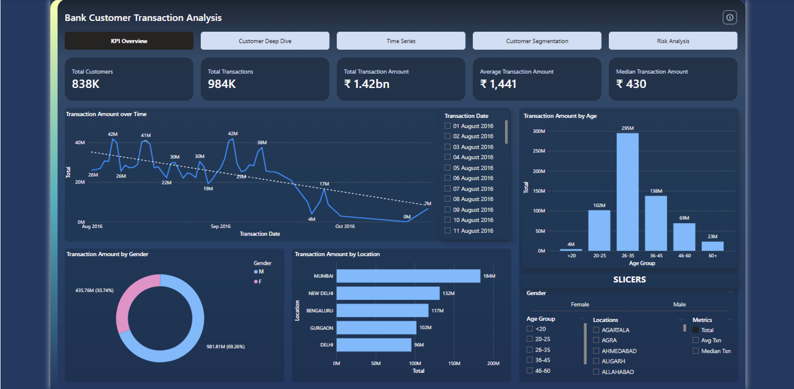
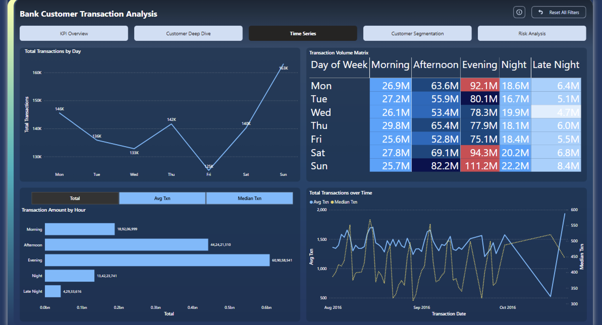
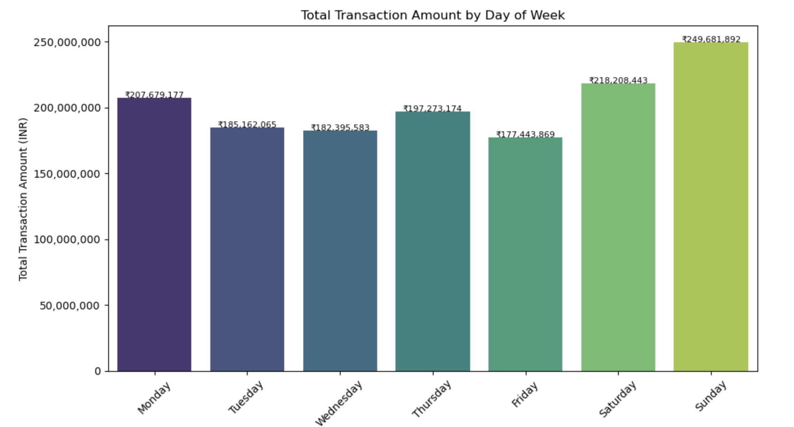
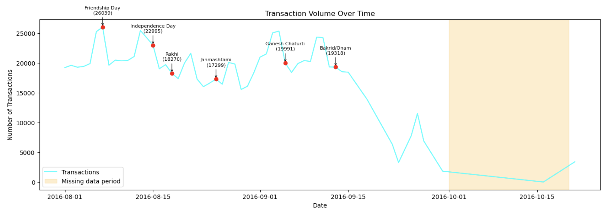
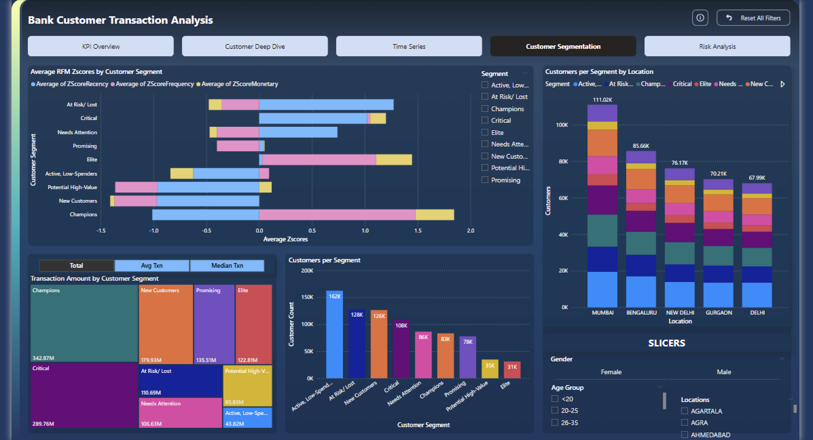
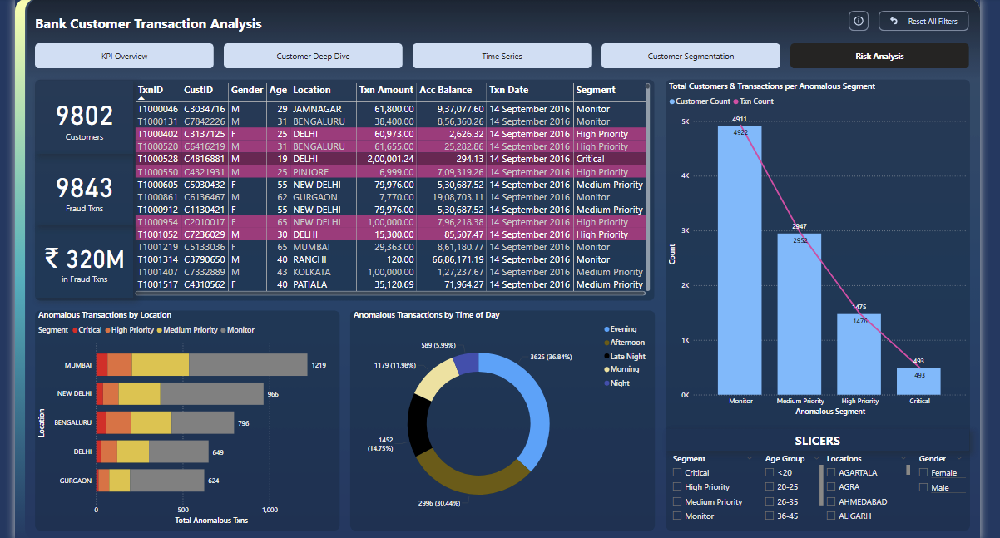
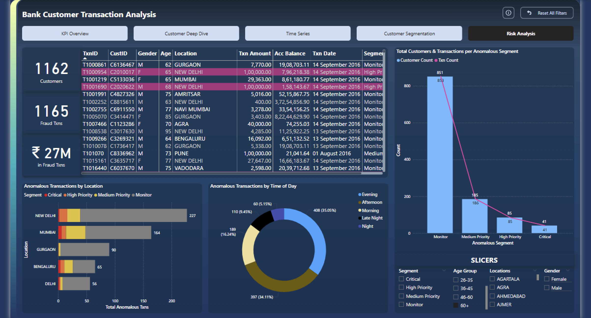
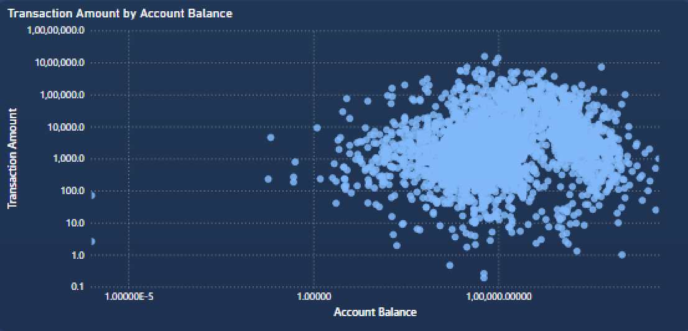
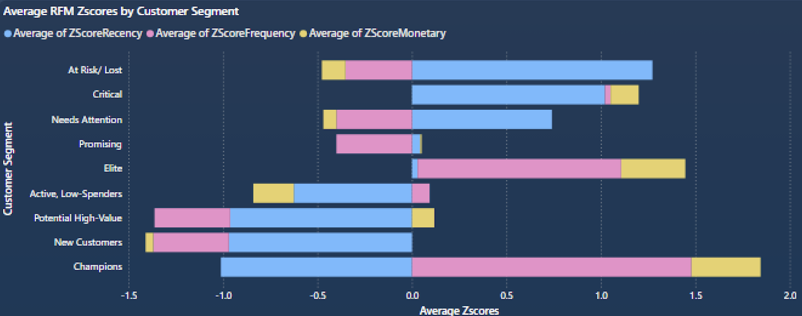
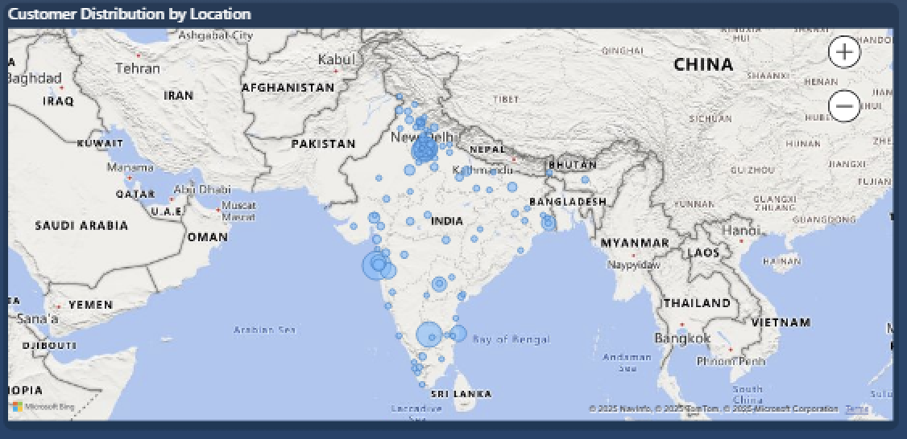

## Detailed Key Insights

### 1. Comprehensive Customer Demographics & Behaviour Profiles

- The bank’s customer base totals approximately **838k** with a total of **942k** transactions, summing up to a total of **₹1.42Bn** in transaction amount, in the domestic market, with a strong concentration in the **urban working-age group (26-35 years)**, reflecting a demographic of salaried professionals.  
- Gender distribution is skewed towards **males (~69%)**, though females demonstrate a **slightly higher median transaction amount**, indicating potential untapped high-value segments.  
- Geographically, cities like **Mumbai, New Delhi, Bengaluru, and Gurgaon**, with the **Delhi District** emerge as critical hubs, collectively driving substantial transaction volumes and value.

### 2. Transactional Trends & Seasonality

- Transaction volumes experience clear **weekly seasonality**, peaking on **Fridays and weekends**, which aligns with consumer spending behaviours. However, contrary to expectations, Mondays were observed to show higher total transactional volume than Fridays, with a near equal median transactional volume. This could serve as a future point for deeper analysis.

- **Time-of-day analysis** reveals the highest transaction amounts occur in the **evening and afternoon**, with significant activity starting mid-day and tapering off late night. 
- Public holidays, especially those of culture significance trigger spikes in transaction frequency and amounts, signifying these periods as prime windows for targeted campaigns.

### 3. Segmentation Insights & Customer Value Proposition

- RFM-based segments such as **Champions, Elite, and Potential High-Value** customers dominate the top percentile of transaction value and frequency.  
- Segments identified as **“At Risk” and “Needs Attention”** exhibit decreased transaction activity, signalling imminent churn risk that could incur long-term revenue losses if unmanaged.  
- The **Promising and New Customers** segments highlight growth opportunities through carefully curated onboarding and engagement strategies.

### 4. Risk and Fraud Analytics

- Anomaly detection flags around **~9K customers, ~9.5K txns**, based on deviation from typical transaction behaviour and Z-score thresholds.  
- The bulk of high-risk anomalous transactions concentrates in Mumbai and New Delhi, with **Bengaluru showing a notable share of critical flagged transactions** deserving focused attention.  
- Unusual patterns arise primarily during **evening and late-night hours**, suggesting temporal fraud vulnerability periods.
- The age group of 60+ observes the largest share of customers flagged with anomalous transactions w.r.t to their customer base at a whopping **~8%**, indicating that senior citizens may possibly be the victims of targeted fraud attacks and phishing attempts.

### 5. Growth and Revenue Performance Metrics

- Transaction skewness is notable, with a **median transaction amount (~₹430)** considerably lower than the average (~₹1,441), highlighting the presence of several large-value outliers. 
[Median vs Average Txn Skew](../Power_BI/images/median_vs_avg.png)

 - Average and median RFM Z-scores across segments underscore behavioural and monetary disparities that aid in hyper-targeted product and marketing fitments.

- Location-wise, strategic branches and digital services in **Mumbai, Delhi NCR, Bengaluru, and Hyderabad** remain growth epicenters, guided by transaction distribution and customer density.

---

## Real-World Growth & Revenue Solutions (Expanded)

### A. Customer-Centric Marketing

- **Target High-Value Segments:**  
  The analysis clearly identifies **Champions** and **Elite** groups as the primary contributors to the bank’s revenue, characterised by high transaction frequency and substantial monetary value.  
  - **Personalised Offers:** Develop exclusive loyalty programs, premium credit card offers, and tailored investment products targeted specifically at these high-value customers.  
  - **Loyalty Benefits:** Introduce tiered reward systems encouraging increased engagement, with benefits like priority customer service, travel perks, and higher cash-back rates.  
  - **Retention Focus:** Proactively engage these customers via personalised communications and financial advisory services to limit churn and maximise lifetime value.

- **Revive At-Risk Segments:**  
  Customers identified as "At Risk" or "Needs Attention" exhibit declining transaction activity and lower balances. These segments are vulnerable to churn, posing revenue risk totalling upto **₹217Mn** in losses.
  - **Churn Prediction Modelling:** Use predictive analytics to identify early warning signs within these segments, such as decreased transaction frequency or anomaly scores.  
  - **Targeted Retention Campaigns:** Roll out reactivation offers, financial health check-ups, and tailored product recommendations to re-engage these customers.  
  - **Personal Outreach:** Use direct communication channels (calls, SMS, email) with personalised messages addressing their specific needs and concerns.

- **Age & Gender Specific Strategies:**  
  The bank’s demographic mix shows a dominant 26-35 age group and a gender skew towards males (~69%), but with females showing slightly higher median transaction values.  
  - **Segmented Product Development:** Offer digital-first banking solutions and mobile-centric services tailored for tech-savvy younger professionals.  
  - **Female-Oriented High-Value Products:** Develop and market premium loan products, insurance, and wealth management services catering to female customers’ preferences and spending patterns.  
  - **Gender-Aware Loyalty Programs:** Incentivise and reward frequent male customers to maintain engagement through gamification, exclusive events, or tier upgrades.

- **Timing-Optimised Engagement:**  
  Transaction peaks on weekends and evenings (4:30 PM – 9:30 PM) suggest optimal interaction windows.  
  - Schedule marketing campaigns, promotional offers, and push notifications (possibly by making use of Clevertap's **RenderMax©**) during these high engagement periods to maximise visibility and uptake.  
  - Align customer service availability and chatbot hours to peak transaction times for enhanced support and frictionless customer experience.  
  - Conversely, schedule system updates and backend maintenance during low-activity periods like late nights to minimise customer impact.

---

### B. Operational & Fraud Risk Mitigation

- **Enhanced Anomaly Detection:**  
  The fraud risk model identifies anomalous transactions by features like transaction amount relative to location (`AmountZScoreByLocation`), timing patterns, and frequency spikes. Bengaluru, notably, shows elevated critical transaction counts.  
  - **Real-Time Monitoring:** Integrate these risk features into a real-time fraud detection engine to flag high-priority alerts instantaneously for manual review.  
  - **Focused Surveillance:** Deploy enhanced customer monitoring in Bengaluru first, leveraging geospatial and behavioural data to tighten control over anomalous activities.  
  - **Adaptive Risk Scoring:** Continuously update risk models with new transaction patterns to improve detection accuracy and reduce false positives.

- **Fraud Prevention Campaigns:**  
  Customer education targeted at recognising suspicious transaction patterns, emphasising risks in evening and late-night hours where anomalies surface more frequently.  
  - Develop clear communication materials and in-app alerts to raise awareness of fraud risks during vulnerable periods.
  - Engage customers with multi-factor authentication and behavioural biometrics during high-risk time windows.
  - Temporarily block a transaction with an unnaturally high amount for a given Customer ID with no such history, only allowing the transaction to pass through after verification through a phone call or an e-mail.

- **Data-Driven Audit Trails:**  
  Use anomaly metrics, Z-scores, and segment-level risk scores to prioritise audits and compliance efforts.  
  - Focus regulatory scrutiny and internal resources on segments and locations with a history of higher fraud detections.  
  - Automate suspicious transaction reporting through data pipelines linked to compliance dashboards.

---

### C. Revenue Growth & Cross-Selling

- **Leverage Behavioural Insights:**  
  Explore correlations between transaction behaviour and account balances for identifying cross-selling and up-selling opportunities.  
  - **High-value** segments with stable account balances are prime candidates for investment products, loans, and credit enhancements.  
  - Frequent shoppers and loyal customers could be nudged towards premium credit cards or bundled banking services.  

- **Dynamic Pricing & Offers:**  
  Timing and transaction amount trends enable launching **time-sensitive promotions** such as cash-back during off-peak periods, festive offers, or loan discounts tied to transaction behaviours.  
  - Use Machine Learning models such as **Gradient Boosting for prediction, Multi-armed bandits for personalisation** to train pricing models, so as to personalise interest rates and fees per segment, increasing uptake and satisfaction.

- **Geographical Expansion:**  
  Concentrate branch expansions, digital channel investments, and local marketing in transaction-rich neighbourhoods like **Mumbai, New Delhi, Bengaluru, Gurgaon, and Delhi district**.  
  - Tailor product accessibility—such as regional language support (Kannada, Hindi, Marathi) or location-specific financial products.  
  - Use geo-targeted advertising and optimise ATM and branch placements to match customer density and transactional intensity.

---

## Conclusion

This comprehensive data story blends analytics with actionable business strategies to help the bank unlock growth and operational efficiency. Customer segmentation combined with time-sensitive transaction and risk analysis enables:

- Hyper-personalised marketing enhancing customer lifetime value
- Proactive fraud risk management safeguarding assets and reputation
- Insight-driven product development and cross-selling boosting revenues
- Location-targeted efforts optimising resource allocation

---

## Next Steps

- Deploy automated segmentation-driven campaign management systems.  
- Integrate fraud risk scores into transaction processing and customer profiling. Use existing data to create a labelled anomalous dataset, in order to develop a much more robust and scalable fraud detection model using XGBoost or Random Forest.
- Regularly update time-based insights to adapt marketing and operational strategies dynamically.  
- Extend data literacy and dashboard utilisation to frontline teams for continuous improvement.

By weaving deep data insights and clear narratives, the bank can sustain competitive advantage and future-proof its customer engagement and risk frameworks.
