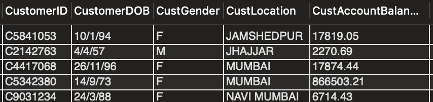
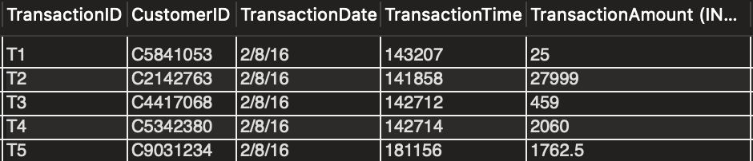
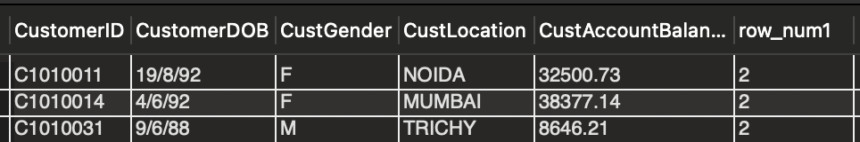
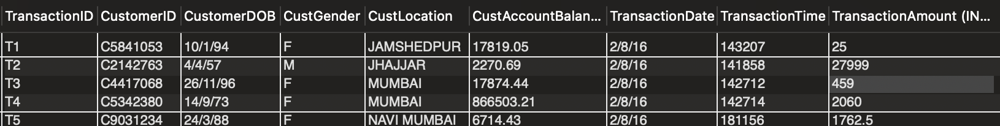

SELECT *
FROM Banking.customers;

SELECT *
FROM Banking.transactions;

WITH duplicate_cte AS
(
SELECT *,
ROW_NUMBER() OVER (
PARTITION BY CustomerID) AS row_num1
FROM customers
)
SELECT *
FROM duplicate_cte
WHERE row_num1>1;

    
    
SELECT *
FROM bank_customer_transactions_dedup;

SELECT CASE
            WHEN (SELECT COUNT(*) FROM transactions) =
                 (SELECT COUNT(*) FROM bank_customer_transactions_dedup)
           THEN 'JOIN SUCCESSFUL'
           ELSE 'JOIN FAILED'
       END AS Result;

