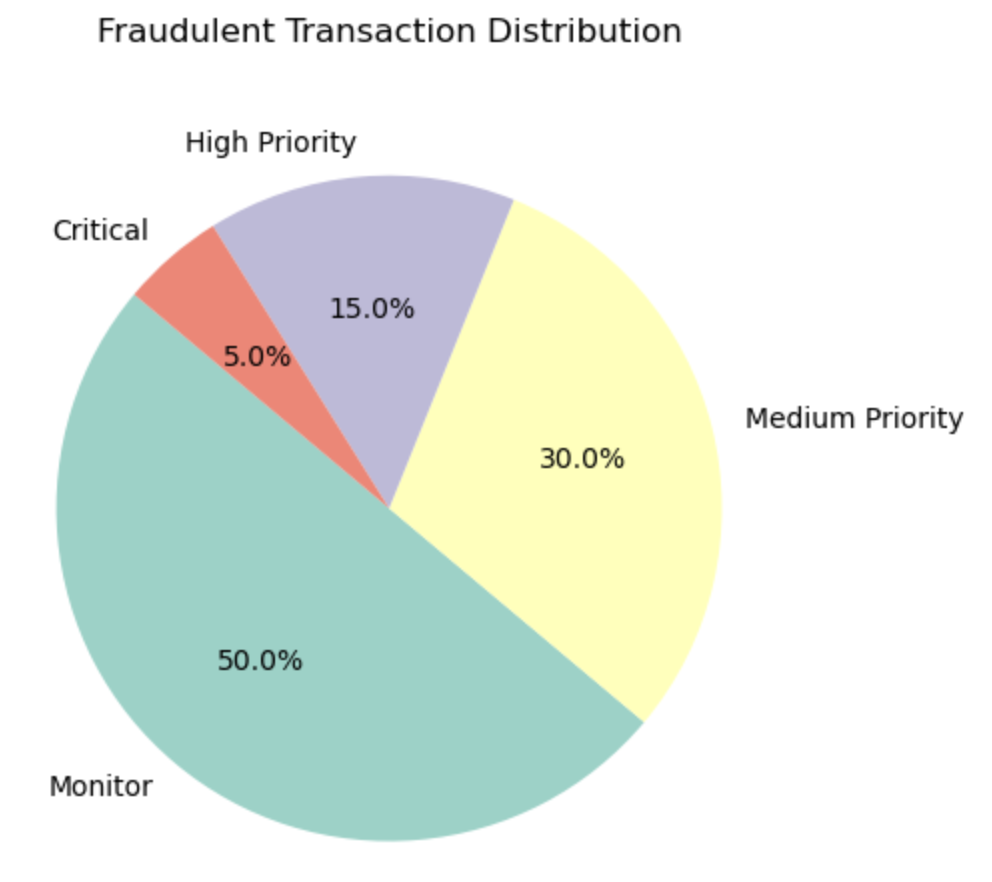

# Python Data Analysis Pipeline: Bank Customer Transactions

This directory contains the Python scripts and Jupyter Notebooks used for the end-to-end analysis of bank customer transaction data. The pipeline handles data ingestion from a SQL database, cleaning, feature engineering, exploratory analysis, customer segmentation, and anomaly detection.

## Pipeline Architecture

The workflow is designed as a sequence of modular notebooks. Each notebook performs a specific task and generates data artifacts (`.parquet` and `.csv` files) that are used by subsequent notebooks or the final Power BI dashboard. This modular approach ensures reproducibility and clarity.

---

## Module Breakdown

### 1. `Data_Preprocessing.ipynb`
*   **Function:** Ingests and cleans the raw transactional data.
*   **Technical Details:**
    *   Connects to a MySQL database using `SQLAlchemy` and `mysql-connector-python`.
    *   Performs data type conversions (`object` to `datetime`) and cleans column names.
    *   **Feature Engineering:**
        *   Calculates customer `Age` from their `CustomerDOB`.
        *   Creates demographic cohorts (`age_group`) using `pd.cut`.
        *   Filters through 8000+ unique locations, such that they are standardised, whilst avoiding duplicates due to improper data entry and/or formatting by users. Creates a sub-dataframe that holds all foreign locations for future analyses, while avoiding their inflated data from affecting domestic customer analysis - The latter being the scope of this project.
    *   **Output:** A cleaned and enriched DataFrame is saved as `data/Transactions_Cleaned.parquet`. The Parquet format is used for its efficient columnar storage and compression, which speeds up I/O operations in subsequent analytical steps.

### 2. `EDA.ipynb`
*   **Function:** Conducts exploratory data analysis to uncover initial patterns.
*   **Technical Details:**
    *   Leverages `matplotlib` and `seaborn` for visualization.
    *   **Univariate Analysis:** Generates plots for the distribution of key demographic features:
        *   Gender Distribution (Pie Chart)
        *   Customer Count by Location (Bar Chart)
        *   Customer Count by Age Group (Bar Chart)
    *   **Bivariate Analysis:** Investigates relationships between variables:
        *   Median Transaction Amount by Gender and Age Group.
        *   Median Transaction Amount for the Top 10 Customer Locations.

### 3. `Segmentation_and_Risk_Analysis.ipynb`
*   **Function:** Applies machine learning techniques for customer segmentation and fraud/anomaly detection.
*   **Technical Details:**
    *   **RFM Segmentation:**
        *   Aggregates transactional data to a customer-level view using `groupby()`.
        *   Calculates **Recency**, **Frequency**, and **Monetary (RFM)** scores for each customer. Recency is calculated relative to the last transaction date in the dataset.
        *   Assigns customers to actionable segments as per best practices in the finance industry (e.g., *Champions*, *At-Risk*) based on their RFM scores.
        *   **Output:** Divides the different customers into actionable segments based on their transaction profile, exported out in a `customer_segments.csv` file containing the segment for each `CustomerID`.
    *   **Anomaly Detection:**
        *   **Model:** Implements an unsupervised `IsolationForest` model from `scikit-learn`. This was chosen due to the unlabeled nature of the dataset and its effectiveness in identifying outliers in high-dimensional data.
        *   **Risk-Based Feature Engineering:** Creates features specifically for the model, such as:
            *   `AmountZScoreByLocation`: Standard score of a transaction amount relative to the customer's location average.
            *   `TimeSinceLastTxn`: Time delta from the customer's previous transaction.
            *   Binary flags like `IsWeekend`, `IsHoliday`, `IsLateNight`.
        *   **Output:** The model predicts and assigns an `IsAnomaly` flag (-1 for anomalies, 1 for inliers) to each transaction in the main DataFrame.

### 4. `Time_Series.ipynb`
*   **Function:** Analyzes temporal trends in transaction data.
*   **Technical Details:**
    *   Derives temporal features like `DayOfWeek` and `TimeOfDay` from the `TransactionDate` and `TransactionTime` columns.
    *   Aggregates data to analyze and visualize:
        *   Median transaction amount and total transaction count by day of the week.
        *   Median transaction amount and total transaction count by time of day (e.g., Morning, Evening, Late Night).
    *   Generates a time-series plot of transaction volume, annotating key public holidays (as per 2016 calendar) to visually demonstrate their impact on spending activity.

---

## Execution Workflow

To ensure the pipeline runs correctly, the notebooks must be executed in the following order:

1.  **`Data_Preprocessing.ipynb`**: This creates the essential `Transactions_Cleaned.parquet` file.
2.  **`EDA.ipynb`**: This uses the cleaned data for exploratory visualizations.
3.  **`Segmentation_and_Risk_Analysis.ipynb`**: This also uses the cleaned data and produces customer segment files.
4.  **`Time_Series.ipynb`**: This notebook performs the final temporal analysis.

The output files from this pipeline are the primary data sources for the accompanying Power BI dashboard.

# EXAMPLE OUTPUTS

